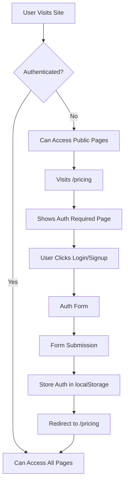

# Trivitron Digital Website - Technical Documentation

## 📋 Table of Contents

1. [Project Architecture Overview](#project-architecture-overview)
2. [File Structure & Components](#file-structure--components)
3. [Component Logic Walkthrough](#component-logic-walkthrough)
4. [Authentication Flow](#authentication-flow)
5. [Routing & Navigation](#routing--navigation)
6. [State Management](#state-management)
7. [Styling & UI System](#styling--ui-system)
8. [Data Flow](#data-flow)
9. [Performance Considerations](#performance-considerations)

---

## 1. Project Architecture Overview

### Technology Stack
- **Framework**: Next.js 14 (App Router)
- **Language**: TypeScript
- **Styling**: Tailwind CSS
- **UI Components**: Radix UI primitives
- **Icons**: Lucide React
- **Authentication**: localStorage (demo implementation)

### Architecture Pattern
- **Multi-page Application (MPA)** with client-side routing
- **Component-based architecture** with reusable UI components
- **Authentication-gated content** for pricing information
- **Responsive design** with mobile-first approach

---

## 2. File Structure & Components

### 📁 Root Directory Structure

```
trivitron-digital-website/
├── app/                    # Next.js App Router pages
├── components/             # React components
├── lib/                   # Utility functions
├── README.md              # Setup instructions
├── TECHNICAL_DOCUMENTATION.md  # This file
├── update-docs.sh         # Documentation update script
├── package.json           # Dependencies and scripts
├── tsconfig.json          # TypeScript configuration
├── tailwind.config.js     # Tailwind CSS configuration
├── next.config.js         # Next.js configuration
└── .gitignore            # Git ignore patterns
```

### 📁 App Directory (Pages)

| File | Component | Purpose | Authentication Required |
|------|-----------|---------|------------------------|
| `app/page.tsx` | HomePage | Landing page with hero and stats | No |
| `app/about/page.tsx` | AboutPage | Company information and mission | No |
| `app/products/page.tsx` | ProductsPage | Product showcase and features | No |
| `app/pricing/page.tsx` | PricingPage | Protected pricing information | **Yes** |
| `app/leadership/page.tsx` | LeadershipPage | Team profiles and structure | No |
| `app/contact/page.tsx` | ContactPage | Contact form and information | No |
| `app/auth/login/page.tsx` | LoginPage | User authentication | No |
| `app/auth/signup/page.tsx` | SignupPage | User registration | No |
| `app/layout.tsx` | RootLayout | Global layout with header/footer | No |
| `app/globals.css` | - | Global styles and Tailwind config | - |

### 📁 Components Directory

#### Core Layout Components
| File | Component | Purpose | Used In |
|------|-----------|---------|---------|
| `components/header.tsx` | Header | Navigation and branding | All pages |
| `components/footer.tsx` | Footer | Site footer with links | All pages |
| `components/hero.tsx` | Hero | Landing page hero section | Home page |
| `components/stats.tsx` | Stats | Animated statistics | Home page |

#### Feature Components
| File | Component | Purpose | Used In |
|------|-----------|---------|---------|
| `components/about.tsx` | About | Company information | About page |
| `components/products.tsx` | Products | Product showcase | Products page |
| `components/pricing.tsx` | Pricing | Pricing tables | Pricing page (authenticated) |
| `components/pricing-auth.tsx` | PricingAuth | Auth gate for pricing | Pricing page |
| `components/leadership.tsx` | Leadership | Team profiles | Leadership page |
| `components/contact.tsx` | Contact | Contact form | Contact page |

#### Authentication Components
| File | Component | Purpose | Used In |
|------|-----------|---------|---------|
| `components/auth/login-form.tsx` | LoginForm | Login form with validation | Login page |
| `components/auth/signup-form.tsx` | SignupForm | Registration form | Signup page |

#### UI Components (Reusable)
| File | Component | Purpose | Used Throughout |
|------|-----------|---------|-----------------|
| `components/ui/button.tsx` | Button | Styled button component | All components |
| `components/ui/card.tsx` | Card | Card container component | Multiple components |
| `components/ui/input.tsx` | Input | Form input component | Forms |
| `components/ui/label.tsx` | Label | Form label component | Forms |
| `components/ui/select.tsx` | Select | Dropdown select component | Forms |
| `components/ui/tabs.tsx` | Tabs | Tabbed interface component | Products |
| `components/ui/textarea.tsx` | Textarea | Multi-line text input | Contact form |
| `components/ui/badge.tsx` | Badge | Status/label badges | Multiple components |

#### Utility Files
| File | Purpose | Exports |
|------|---------|---------|
| `lib/utils.ts` | Utility functions | `cn()` for className merging |

---

## 3. Component Logic Walkthrough

### 🏠 Home Page Flow (`app/page.tsx`)

```typescript
export default function HomePage() {
  return (
    <main className="min-h-screen">
      <Hero />      // Hero section with CTA buttons
      <Stats />     // Animated statistics counter
    </main>
  )
}
```

**Logic Flow:**
1. Renders Hero component with main value proposition
2. Displays animated Stats component with key metrics
3. Hero includes CTAs that route to signup/demo

### 🦸 Hero Component (`components/hero.tsx`)

```typescript
export function Hero() {
  const [isVideoPlaying, setIsVideoPlaying] = useState(false)
  
  // Main hero section with:
  // - Company branding and value proposition
  // - CTA buttons (Get Started -> /auth/signup, Watch Demo)
  // - Key statistics display
  // - Interactive dashboard preview
}
```

**Key Features:**
- **State Management**: Video modal state
- **Navigation**: Links to signup and demo
- **Interactive Elements**: Hover effects on dashboard preview
- **Responsive Design**: Grid layout that adapts to screen size

### 📊 Stats Component (`components/stats.tsx`)

```typescript
export function Stats() {
  const [counts, setCounts] = useState({
    hospitals: 0, countries: 0, patients: 0, accuracy: 0
  })

  useEffect(() => {
    // Animated counter logic
    const targets = { hospitals: 500, countries: 80, patients: 1000000, accuracy: 98.5 }
    // Incremental animation over 2 seconds
  }, [])
}
```

**Animation Logic:**
1. **Initial State**: All counters start at 0
2. **useEffect Hook**: Triggers animation on component mount
3. **setInterval**: Updates counters incrementally over 2 seconds
4. **Cleanup**: Clears interval when animation completes

### 🔐 Authentication Gate (`components/pricing-auth.tsx`)

```typescript
export function PricingAuth() {
  const [isAuthenticated, setIsAuthenticated] = useState(false)
  const [user, setUser] = useState<any>(null)
  const [isLoading, setIsLoading] = useState(true)

  useEffect(() => {
    // Check localStorage for authentication
    const authData = localStorage.getItem("trivitron_auth")
    if (authData) {
      const parsed = JSON.parse(authData)
      if (parsed.isAuthenticated) {
        setIsAuthenticated(true)
        setUser(parsed.user)
      }
    }
    setIsLoading(false)
  }, [])

  // Conditional rendering based on auth state
  if (!isAuthenticated) {
    return <AuthRequiredView />  // Login/signup prompts
  }
  
  return <AuthenticatedView />   // Full pricing content
}
```

**Authentication Logic:**
1. **Loading State**: Shows spinner while checking auth
2. **Auth Check**: Reads from localStorage on component mount
3. **Conditional Rendering**: 
   - Unauthenticated: Shows benefits and login prompts
   - Authenticated: Shows welcome message and full pricing
4. **User Context**: Displays user name and organization

### 📝 Login Form (`components/auth/login-form.tsx`)

```typescript
export function LoginForm() {
  const [formData, setFormData] = useState({ email: "", password: "" })
  const [isLoading, setIsLoading] = useState(false)
  const router = useRouter()

  const handleSubmit = async (e: React.FormEvent) => {
    e.preventDefault()
    setIsLoading(true)

    // Simulate authentication (replace with real API)
    setTimeout(() => {
      localStorage.setItem("trivitron_auth", JSON.stringify({
        isAuthenticated: true,
        user: { email: formData.email, name: formData.email.split("@")[0] }
      }))
      router.push("/pricing")  // Redirect to pricing after login
    }, 1500)
  }
}
```

**Form Logic:**
1. **State Management**: Form data and loading state
2. **Form Validation**: HTML5 validation (required, email type)
3. **Submission**: Simulated API call with loading state
4. **Authentication**: Stores user data in localStorage
5. **Navigation**: Redirects to pricing page after successful login

### 🛍️ Products Component (`components/products.tsx`)

```typescript
export function Products() {
  const products = [/* Product data array */]
  const iotSolutions = [/* IoT solutions data */]

  return (
    <Tabs defaultValue="saas">
      <TabsList>
        <TabsTrigger value="saas">AI SaaS Platforms</TabsTrigger>
        <TabsTrigger value="iot">IoT Smart Devices</TabsTrigger>
      </TabsList>
      
      <TabsContent value="saas">
        {/* SaaS products grid */}
      </TabsContent>
      
      <TabsContent value="iot">
        {/* IoT solutions grid */}
      </TabsContent>
    </Tabs>
  )
}
```

**Tabbed Interface Logic:**
1. **Data Structure**: Static arrays for products and IoT solutions
2. **Tab State**: Managed by Radix UI Tabs component
3. **Content Switching**: Shows different content based on active tab
4. **Responsive Grid**: Adapts layout for different screen sizes

### 💰 Pricing Component (`components/pricing.tsx`)

```typescript
export function Pricing() {
  const [billingCycle, setBillingCycle] = useState<"monthly" | "annual">("monthly")
  
  const plans = [
    {
      name: "Basic",
      price: billingCycle === "monthly" ? "₹10,000" : "₹1,00,000",
      // ... plan details
    }
    // ... other plans
  ]
}
```

**Pricing Logic:**
1. **Billing Toggle**: State for monthly/annual pricing
2. **Dynamic Pricing**: Prices change based on billing cycle
3. **Plan Comparison**: Visual comparison of features
4. **CTA Buttons**: Different actions based on plan type

---

## 4. Authentication Flow

### Authentication States



### Authentication Implementation

#### 1. Auth Check (PricingAuth Component)
```typescript
useEffect(() => {
  const authData = localStorage.getItem("trivitron_auth")
  if (authData) {
    const parsed = JSON.parse(authData)
    if (parsed.isAuthenticated) {
      setIsAuthenticated(true)
      setUser(parsed.user)
    }
  }
  setIsLoading(false)
}, [])
```

#### 2. Login Process
```typescript
const handleSubmit = async (e: React.FormEvent) => {
  e.preventDefault()
  setIsLoading(true)

  // Simulate API call
  setTimeout(() => {
    localStorage.setItem("trivitron_auth", JSON.stringify({
      isAuthenticated: true,
      user: {
        email: formData.email,
        name: formData.email.split("@")[0],
      },
    }))
    router.push("/pricing")
  }, 1500)
}
```

#### 3. Logout Process
```typescript
const handleLogout = () => {
  localStorage.removeItem("trivitron_auth")
  setIsAuthenticated(false)
  setUser(null)
}
```

---

## 5. Routing & Navigation

### Next.js App Router Structure

```
app/
├── page.tsx                 # / (Home)
├── about/
│   └── page.tsx            # /about
├── products/
│   └── page.tsx            # /products
├── pricing/
│   └── page.tsx            # /pricing (protected)
├── leadership/
│   └── page.tsx            # /leadership
├── contact/
│   └── page.tsx            # /contact
└── auth/
    ├── login/
    │   └── page.tsx        # /auth/login
    └── signup/
        └── page.tsx        # /auth/signup
```

### Navigation Component (`components/header.tsx`)

```typescript
const navigation = [
  { name: "Home", href: "/" },
  { name: "About", href: "/about" },
  { name: "Products", href: "/products" },
  { name: "Pricing", href: "/pricing" },
  { name: "Leadership", href: "/leadership" },
  { name: "Contact", href: "/contact" },
]

// Mobile menu state
const [isMenuOpen, setIsMenuOpen] = useState(false)

// Scroll-based header styling
const [isScrolled, setIsScrolled] = useState(false)
useEffect(() => {
  const handleScroll = () => setIsScrolled(window.scrollY > 10)
  window.addEventListener("scroll", handleScroll)
  return () => window.removeEventListener("scroll", handleScroll)
}, [])
```

**Navigation Features:**
- **Responsive Design**: Desktop nav + mobile hamburger menu
- **Scroll Effects**: Header background changes on scroll
- **Active States**: Visual feedback for current page
- **CTA Integration**: Signup button in navigation

---

## 6. State Management

### Component-Level State

#### 1. Form State Management
```typescript
// Login/Signup forms
const [formData, setFormData] = useState({
  email: "",
  password: "",
  // ... other fields
})

// Generic input handler
const handleInputChange = (field: string, value: string) => {
  setFormData(prev => ({ ...prev, [field]: value }))
}
```

#### 2. UI State Management
```typescript
// Modal/dropdown states
const [isMenuOpen, setIsMenuOpen] = useState(false)
const [showPassword, setShowPassword] = useState(false)

// Loading states
const [isLoading, setIsLoading] = useState(false)

// Tab states (handled by Radix UI)
<Tabs defaultValue="saas" onValueChange={setActiveTab}>
```

#### 3. Authentication State
```typescript
const [isAuthenticated, setIsAuthenticated] = useState(false)
const [user, setUser] = useState<any>(null)

// Persistent storage
localStorage.setItem("trivitron_auth", JSON.stringify({
  isAuthenticated: true,
  user: userData
}))
```

### Global State (Layout Level)

```typescript
// app/layout.tsx
export default function RootLayout({ children }: { children: React.ReactNode }) {
  return (
    <html lang="en" className="scroll-smooth">
      <body className={inter.className}>
        <Header />        {/* Global navigation */}
        {children}        {/* Page content */}
        <Footer />        {/* Global footer */}
      </body>
    </html>
  )
}
```

---

## 7. Styling & UI System

### Tailwind CSS Configuration

```javascript
// tailwind.config.js
module.exports = {
  content: [
    "./pages/**/*.{js,ts,jsx,tsx,mdx}",
    "./components/**/*.{js,ts,jsx,tsx,mdx}",
    "./app/**/*.{js,ts,jsx,tsx,mdx}",
  ],
  theme: {
    extend: {
      colors: {
        // Custom color system for healthcare theme
        primary: "hsl(var(--primary))",
        secondary: "hsl(var(--secondary))",
        // ... other colors
      },
      borderRadius: {
        lg: "var(--radius)",
        md: "calc(var(--radius) - 2px)",
        sm: "calc(var(--radius) - 4px)",
      },
    },
  },
}
```

### CSS Custom Properties (`app/globals.css`)

```css
:root {
  --background: oklch(1 0 0);
  --foreground: oklch(0.145 0 0);
  --primary: oklch(0.205 0 0);
  --radius: 0.625rem;
  /* ... other variables */
}

@layer utilities {
  .bg-grid-pattern {
    background-image: radial-gradient(circle, #e5e7eb 1px, transparent 1px);
    background-size: 20px 20px;
  }
}
```

### Component Styling Patterns

#### 1. Utility-First Approach
```typescript
<div className="min-h-screen flex items-center justify-center bg-gradient-to-br from-blue-50 via-white to-green-50">
```

#### 2. Responsive Design
```typescript
<div className="grid md:grid-cols-2 lg:grid-cols-3 gap-8">
```

#### 3. Interactive States
```typescript
<button className="bg-blue-600 hover:bg-blue-700 transition-colors duration-300">
```

#### 4. Component Variants (using CVA)
```typescript
const buttonVariants = cva(
  "inline-flex items-center justify-center rounded-md text-sm font-medium",
  {
    variants: {
      variant: {
        default: "bg-primary text-primary-foreground hover:bg-primary/90",
        outline: "border border-input hover:bg-accent",
      },
      size: {
        default: "h-10 px-4 py-2",
        lg: "h-11 rounded-md px-8",
      },
    },
  }
)
```

---

## 8. Data Flow

### Static Data Structure

#### Product Data
```typescript
const products = [
  {
    id: "letsgo",
    name: "LetsGo Basic",
    price: "₹10,000/month",
    features: [
      "Patient Health Record with ABHA compliance",
      "AI Agents on WhatsApp, Web App, and notifications",
      // ... more features
    ],
    benefits: [
      "Reduces front-desk load significantly",
      // ... more benefits
    ],
  },
  // ... other products
]
```

#### Leadership Data
```typescript
const leaders = [
  {
    name: "Dr. G.S.K. Velu",
    role: "Chairman & Managing Director",
    company: "Trivitron Healthcare",
    bio: "Forbes-recognized serial entrepreneur...",
    achievements: ["Forbes Recognition", "80+ Countries Presence"],
  },
  // ... other leaders
]
```

### Form Data Flow

#### 1. Contact Form
```typescript
const [formData, setFormData] = useState({
  name: "", email: "", phone: "", organization: "",
  role: "", hospitalSize: "", interest: "", message: ""
})

const handleSubmit = (e: React.FormEvent) => {
  e.preventDefault()
  // Process form data
  console.log("Form submitted:", formData)
  alert("Thank you for your interest! We will contact you within 24 hours.")
}
```

#### 2. Authentication Forms
```typescript
// Login flow
const handleSubmit = async (e: React.FormEvent) => {
  e.preventDefault()
  setIsLoading(true)
  
  // Simulate API call
  setTimeout(() => {
    localStorage.setItem("trivitron_auth", JSON.stringify({
      isAuthenticated: true,
      user: { email: formData.email, name: formData.email.split("@")[0] }
    }))
    router.push("/pricing")
  }, 1500)
}
```

### Component Communication

#### Parent-Child Props
```typescript
// Parent component
<PricingAuth />

// Child component receives auth state
function PricingAuth() {
  const [isAuthenticated, setIsAuthenticated] = useState(false)
  
  if (!isAuthenticated) {
    return <AuthRequiredView />
  }
  
  return (
    <div>
      <WelcomeMessage user={user} onSignOut={handleSignOut} />
      <Pricing />
    </div>
  )
}
```

---

## 9. Performance Considerations

### Code Splitting & Lazy Loading

#### 1. Next.js Automatic Code Splitting
- Each page in `app/` directory is automatically code-split
- Components are bundled with their respective pages
- Dynamic imports for heavy components

#### 2. Image Optimization
```typescript
// Using Next.js Image component (when available)
import Image from 'next/image'

<Image
  src="/placeholder.svg?height=400&width=500"
  alt="Modern Hospital Technology"
  width={500}
  height={400}
  className="rounded-lg shadow-lg"
/>
```

#### 3. CSS Optimization
- Tailwind CSS purges unused styles in production
- Critical CSS inlined automatically by Next.js
- Custom utilities defined in `globals.css`

### State Management Optimization

#### 1. Minimal Re-renders
```typescript
// Using useCallback for event handlers
const handleInputChange = useCallback((field: string, value: string) => {
  setFormData(prev => ({ ...prev, [field]: value }))
}, [])

// Using useMemo for expensive calculations
const filteredProducts = useMemo(() => {
  return products.filter(product => product.category === activeCategory)
}, [products, activeCategory])
```

#### 2. Efficient State Updates
```typescript
// Batch state updates
const handleFormSubmit = () => {
  setIsLoading(true)
  setError(null)
  setFormData(prev => ({ ...prev, submitted: true }))
}
```

### Bundle Size Optimization

#### 1. Tree Shaking
```typescript
// Import only what you need
import { Button } from "@/components/ui/button"
import { Card, CardContent, CardHeader } from "@/components/ui/card"

// Instead of importing entire libraries
import { Calendar, Mail, Phone } from 'lucide-react'
```

#### 2. Dynamic Imports
```typescript
// For heavy components that aren't immediately needed
const HeavyComponent = dynamic(() => import('./HeavyComponent'), {
  loading: () => <div>Loading...</div>
})
```

### SEO & Accessibility

#### 1. Semantic HTML
```typescript
<main className="min-h-screen">
  <section aria-labelledby="hero-heading">
    <h1 id="hero-heading">Democratizing Advanced Healthcare</h1>
  </section>
</main>
```

#### 2. Meta Tags (in layout.tsx)
```typescript
export const metadata: Metadata = {
  title: "Trivitron Digital - Democratizing Advanced Healthcare Technology",
  description: "AI-powered SaaS platforms and IoT smart-hospital devices...",
  keywords: "healthcare technology, AI diagnostics, IoT medical devices...",
}
```

#### 3. Accessibility Features
```typescript
// Screen reader support
<div aria-live="polite" aria-atomic="true">
  {formatTime(time)}
</div>

// Keyboard navigation
<button
  onClick={handleClick}
  onKeyDown={(e) => e.key === 'Enter' && handleClick()}
  aria-pressed={isActive}
>
```

---

## 🔧 Development Best Practices

### 1. Component Organization
- **Single Responsibility**: Each component has one clear purpose
- **Reusability**: UI components are generic and reusable
- **Composition**: Complex components built from simpler ones

### 2. TypeScript Usage
- **Strict Mode**: Enabled for better type safety
- **Interface Definitions**: Clear contracts for component props
- **Type Guards**: Runtime type checking where needed

### 3. Error Handling
```typescript
// Form validation
const [errors, setErrors] = useState<Record<string, string>>({})

const validateForm = () => {
  const newErrors: Record<string, string> = {}
  if (!formData.email) newErrors.email = "Email is required"
  if (!formData.password) newErrors.password = "Password is required"
  setErrors(newErrors)
  return Object.keys(newErrors).length === 0
}
```

### 4. Testing Considerations
- Components are designed to be easily testable
- Clear separation of concerns
- Minimal external dependencies

---

This technical documentation provides a comprehensive overview of the Trivitron Digital website's architecture, component structure, and implementation details. It serves as a reference for developers working on the project and helps understand the codebase's organization and logic flow.

**Last Updated**: January 2025
**Version**: 1.0.0
**Maintainer**: Trivitron Digital Development Team
